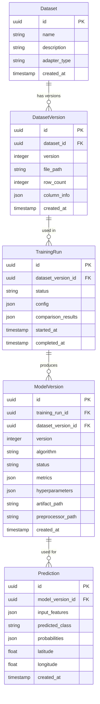
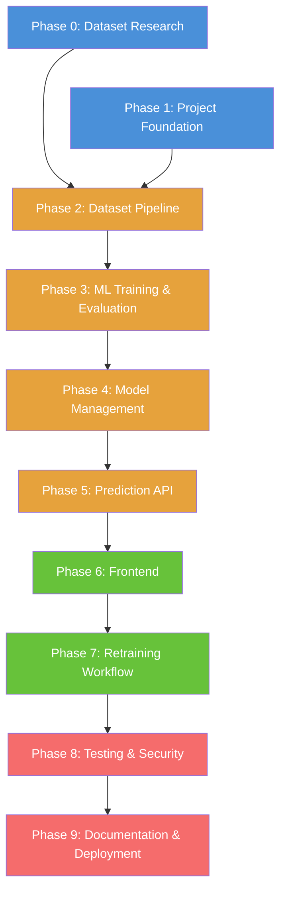

# Architecture Document

## ML-Based Ground/Soil Risk Prediction and Monitoring System

| Field              | Value                                    |
| ------------------ | ---------------------------------------- |
| **Status**         | Active — Phase 1 ML Foundation Complete  |
| **Last Updated**   | 2026-08-28                               |
| **Source**         | [PRD.md](file:///d:/Project/soil-ml-prediction/PRD.md) |

---

## 1. System Overview

The system is a web application that accepts urban road segment measurements, classifies them into **Low / Moderate / High / Critical Risk** using trained ML models, and provides tools for dataset management, model training, comparison, versioning, and monitoring.

> **Phase 0 Complete.** Dataset selected: Urban Road Collapse Risk Assessment Dataset (Kaggle CC0, synthetic, 15,000 rows, 4 classes). Canonical feature schema: 34 model features. See [`docs/dataset_specification.md`](file:///d:/Project/soil-ml-prediction/docs/dataset_specification.md).

### 1.1 High-Level Architecture

```
┌──────────────────────────────┐
│        Vue 3 Frontend        │
│                              │
│  Dashboard                   │
│  Prediction                  │
│  Dataset Management          │
│  Model Management            │
└──────────────┬───────────────┘
               │ HTTP / JSON
               ↓
┌──────────────────────────────┐
│       FastAPI Backend        │
│                              │
│  API Routes                  │
│  Application Services        │
│  ML Pipeline Orchestration   │
└──────────┬───────────────────┘
           │
    ┌──────┴──────────┐
    ↓                 ↓
┌──────────┐   ┌──────────────┐
│PostgreSQL│   │  ML Pipeline │
│          │   │              │
│ Metadata │   │ Preprocess   │
│ Datasets │   │ Train        │
│ Models   │   │ Evaluate     │
│ History  │   │ Compare      │
└──────────┘   └──────┬───────┘
                      ↓
               ┌──────────────┐
               │   File Store │
               │              │
               │ Model .joblib│
               │ Preprocessor │
               │ Datasets     │
               └──────────────┘
```

### 1.2 Component Responsibilities

| Component        | Responsibility                                                                 |
| ---------------- | ------------------------------------------------------------------------------ |
| **Frontend**     | User interface, input forms, data visualization, API communication             |
| **Backend API**  | HTTP endpoints, request validation, orchestration of services                  |
| **Services**     | Business logic: prediction, dataset management, training, model management     |
| **ML Pipeline**  | Data preprocessing, model training, evaluation, comparison                     |
| **PostgreSQL**   | Persistent storage for metadata, prediction history, dataset info, model info  |
| **File Store**   | Serialized model artifacts, preprocessing pipelines, uploaded dataset files    |

---

## 2. Architectural Style

### 2.1 Modular Monolith

The backend is a **single deployable FastAPI application**, internally organized into clear modules with well-defined boundaries.

```
API Routes (thin handlers)
        ↓
Application Services (business logic)
        ↓
Domain / ML Modules (core logic)
        ↓
Persistence / File Storage (data access)
```

### 2.2 Why Not Microservices

| Concern                  | Modular Monolith                          | Microservices                            |
| ------------------------ | ----------------------------------------- | ---------------------------------------- |
| Deployment complexity    | Single container                          | Multiple containers + service mesh       |
| Development overhead     | Minimal                                   | High (APIs, versioning, networking)      |
| Debugging                | Single process, simple stack traces       | Distributed tracing required             |
| Team size                | Appropriate for small/academic team       | Designed for large organizations         |
| Data consistency         | Direct function calls, single DB          | Eventual consistency, distributed txns   |

A modular monolith provides clean separation without the operational overhead that microservices impose. Module boundaries can be promoted to service boundaries later if genuinely needed.

---

## 3. Repository Structure

```
soil-ml-prediction/
├── frontend/                    # Vue 3 + TypeScript application
│   ├── src/
│   │   ├── assets/              # Static assets (icons, images)
│   │   ├── components/          # Reusable Vue components
│   │   ├── composables/         # Vue composition API hooks
│   │   ├── layouts/             # Page layout wrappers
│   │   ├── pages/               # Top-level page views
│   │   ├── router/              # Vue Router configuration
│   │   ├── services/            # API client / HTTP service layer
│   │   ├── stores/              # Pinia state management
│   │   ├── types/               # TypeScript type definitions
│   │   ├── utils/               # Utility functions
│   │   ├── App.vue
│   │   └── main.ts
│   ├── public/
│   ├── index.html
│   ├── package.json
│   ├── tsconfig.json
│   ├── vite.config.ts
│   └── vitest.config.ts
│
├── backend/                     # FastAPI application
│   ├── app/
│   │   ├── api/                 # API route handlers
│   │   │   ├── routes/
│   │   │   │   ├── predictions.py
│   │   │   │   ├── datasets.py
│   │   │   │   ├── training.py
│   │   │   │   ├── models.py
│   │   │   │   └── dashboard.py
│   │   │   ├── dependencies.py  # FastAPI dependency injection
│   │   │   └── router.py        # Route aggregation
│   │   ├── schemas/             # Pydantic request/response models
│   │   ├── services/            # Business logic services
│   │   │   ├── prediction_service.py
│   │   │   ├── dataset_service.py
│   │   │   ├── training_service.py
│   │   │   └── model_service.py
│   │   ├── models/              # SQLAlchemy ORM models
│   │   ├── repositories/        # Database access layer
│   │   ├── core/                # Configuration, startup, logging
│   │   │   ├── config.py
│   │   │   ├── logging.py
│   │   │   └── exceptions.py
│   │   └── main.py              # FastAPI app entry point
│   ├── alembic/                 # Database migrations
│   ├── alembic.ini
│   ├── requirements.txt
│   └── pyproject.toml
│
├── ml/                          # ML pipeline (importable by backend)
│   ├── pipeline/
│   │   ├── preprocessing.py     # Preprocessing pipeline construction
│   │   ├── training.py          # Model training logic
│   │   ├── evaluation.py        # Metrics calculation
│   │   ├── comparison.py        # Multi-model comparison
│   │   └── splitting.py         # Dataset split logic
│   ├── adapters/                # Dataset adapters (canonical schema)
│   │   ├── base.py              # Abstract adapter interface
│   │   └── adapter_registry.py  # Adapter registration
│   ├── models/                  # Algorithm configuration / wrappers
│   │   └── registry.py          # Candidate model definitions
│   └── utils/                   # ML utility functions
│
├── tests/
│   ├── backend/                 # Backend unit + integration tests
│   ├── ml/                      # ML pipeline tests
│   └── conftest.py              # Shared pytest fixtures
│
├── storage/                     # Runtime file storage (Docker volume)
│   ├── datasets/                # Uploaded dataset files
│   ├── models/                  # Serialized model artifacts (.joblib)
│   └── preprocessors/           # Serialized preprocessing pipelines
│
├── docker/
│   ├── frontend.Dockerfile
│   ├── backend.Dockerfile
│   └── nginx.conf               # Reverse proxy (production-like)
│
├── docs/                        # Project documentation
│
├── docker-compose.yml
├── docker-compose.dev.yml       # Development overrides
├── .env.example
├── .gitignore
├── PRD.md
├── ARCHITECTURE.md
└── README.md
```

### 3.1 Directory Responsibilities

| Directory       | Purpose                                                                    |
| --------------- | -------------------------------------------------------------------------- |
| `frontend/`     | Complete Vue 3 application. No ML logic.                                   |
| `backend/`      | FastAPI application. API layer, services, database, orchestration.         |
| `ml/`           | Pure ML code: preprocessing, training, evaluation. No HTTP/DB concerns.    |
| `tests/`        | All automated tests (backend + ML). Frontend tests live in `frontend/`.   |
| `storage/`      | Runtime directory for uploaded datasets, model artifacts, preprocessors.   |
| `docker/`       | Dockerfiles and container configuration.                                   |
| `docs/`         | Technical documentation for handover.                                      |

### 3.2 .gitignore Policy

The following must **not** be committed:

- `.env` (secrets, database credentials)
- `storage/datasets/*` (uploaded user data)
- `storage/models/*` (generated artifacts)
- `storage/preprocessors/*` (generated artifacts)
- `__pycache__/`, `node_modules/`
- IDE configuration files

Provide `.env.example` with placeholder values.

---

## 4. Frontend Architecture

### 4.1 Technology

| Technology     | Purpose                    |
| -------------- | -------------------------- |
| Vue 3          | UI framework               |
| TypeScript     | Type safety                |
| Vite           | Build tool / dev server    |
| Vue Router     | Client-side routing        |
| Pinia          | State management           |
| Vitest         | Unit testing               |

### 4.2 Pages

| Page                  | Route                 | Purpose                                                  | PRD Ref     |
| --------------------- | --------------------- | -------------------------------------------------------- | ----------- |
| **Dashboard**         | `/`                   | Prediction stats, risk distribution, recent history      | F-04 – F-08 |
| **Prediction**        | `/predict`            | Feature input form, prediction result display            | F-01 – F-03 |
| **Prediction History**| `/predictions`        | Full historical prediction list with filtering           | F-07        |
| **Dataset Management**| `/datasets`           | Upload, validate, preview, integrate datasets            | F-09 – F-13 |
| **Model Management**  | `/models`             | Model list, metrics, comparison, promote, rollback       | F-14 – F-25 |
| **Training**          | `/training`           | Initiate training, view progress, view results           | F-18 – F-20 |

### 4.3 Frontend Responsibilities

The frontend is responsible for:

- Rendering the UI and handling user interactions.
- Client-side input validation (type, range, required fields).
- Calling backend API endpoints and displaying responses.
- Visualizing data (charts, tables, optional maps).

The frontend must **NOT**:

- Contain ML training or preprocessing logic.
- Make direct database connections.
- Store sensitive credentials.

### 4.4 API Client Layer

All HTTP communication is centralized in `frontend/src/services/`. Each service file maps to one backend API group:

```
services/
├── api.ts               # Axios/fetch base client, base URL, error handling
├── predictionApi.ts     # Prediction endpoints
├── datasetApi.ts        # Dataset endpoints
├── trainingApi.ts       # Training endpoints
├── modelApi.ts          # Model management endpoints
└── dashboardApi.ts      # Dashboard/monitoring endpoints
```

### 4.5 State Management

Pinia stores are used for:

- Current active model info.
- Dashboard statistics (cached with refresh).
- Training status (polling during active training runs).
- Dataset metadata.

Avoid storing large datasets in frontend state. Paginate and fetch on demand.

---

## 5. Backend Architecture

### 5.1 Module Overview

```
app/
├── api/          → HTTP layer (routes, request parsing, response formatting)
├── schemas/      → Pydantic models (request/response validation)
├── services/     → Business logic (orchestration, rules, coordination)
├── models/       → SQLAlchemy ORM models (database entities)
├── repositories/ → Database access (queries, CRUD operations)
├── core/         → Cross-cutting: config, logging, exception handling
└── main.py       → App factory, startup, middleware
```

### 5.2 Module Responsibilities

#### API Routes (`app/api/routes/`)

- Parse and validate HTTP requests using Pydantic schemas.
- Delegate to appropriate service.
- Format and return HTTP responses.
- **Must remain thin.** No business logic, no direct DB queries, no ML calls.

#### Schemas (`app/schemas/`)

- Pydantic models for request bodies, response bodies, and query parameters.
- Input validation rules (types, ranges, required fields).
- Serialization configuration.

#### Services (`app/services/`)

| Service                | Responsibility                                                          |
| ---------------------- | ----------------------------------------------------------------------- |
| `prediction_service`   | Load active model, apply preprocessing, run prediction, save history    |
| `dataset_service`      | Handle upload, validate schema, preview data, integrate into storage    |
| `training_service`     | Orchestrate training runs: split, preprocess, train, evaluate, compare  |
| `model_service`        | Model registry: list, promote, rollback, version management             |
| `dashboard_service`    | Aggregate statistics, recent predictions, risk distribution             |

#### Repositories (`app/repositories/`)

- Encapsulate all SQLAlchemy queries.
- One repository per database entity group.
- Services call repositories; routes never call repositories directly.

#### Core (`app/core/`)

| Module          | Purpose                                            |
| --------------- | -------------------------------------------------- |
| `config.py`     | Load environment variables, app settings            |
| `logging.py`    | Structured logging configuration                    |
| `exceptions.py` | Custom exception classes and error handlers          |

### 5.3 Dependency Flow

```
Routes → Services → Repositories → Database
                  → ML Pipeline   → File Store
```

No circular dependencies. Routes depend on services. Services depend on repositories and ML modules. Repositories depend on ORM models.

---

## 6. ML Architecture

### 6.1 Pipeline Overview

```
Raw Dataset
     ↓
Dataset Adapter (normalize to canonical schema)
     ↓
Validation (schema, types, labels)
     ↓
Stratified Split (70 / 15 / 15)
     ↓
Preprocessing (fit on train only)
     ↓
Train N Candidate Models
     ↓
Evaluate Each on Validation Set
     ↓
Compare Results
     ↓
Final Evaluation on Test Set (selected model only)
     ↓
Serialize Model + Preprocessor
     ↓
Register in Model Registry
```

### 6.2 Module Structure (`ml/`)

| Module                       | Responsibility                                                   |
| ---------------------------- | ---------------------------------------------------------------- |
| `pipeline/splitting.py`      | Stratified 70/15/15 split with fixed random seed                 |
| `pipeline/preprocessing.py`  | Build scikit-learn `Pipeline` / `ColumnTransformer`              |
| `pipeline/training.py`       | Train a single model given data and algorithm config              |
| `pipeline/evaluation.py`     | Compute metrics: accuracy, precision, recall, F1, confusion matrix |
| `pipeline/comparison.py`     | Compare evaluation results across models, rank by criteria        |
| `adapters/base.py`           | Abstract base class for dataset adapters                          |
| `adapters/adapter_registry.py` | Map dataset type → adapter implementation                       |
| `models/registry.py`         | Define candidate algorithms and default hyperparameters           |

### 6.3 ML Task

Four-class classification:

| Class          | Raw Label in Dataset | Ordinal Encoding |
| -------------- | -------------------- | ---------------- |
| Low Risk       | `"Low"`              | 0                |
| Moderate Risk  | `"Moderate"`         | 1                |
| High Risk      | `"High"`             | 2                |
| Critical Risk  | `"Critical"`         | 3                |

> [!NOTE]
> The target column is `collapse_risk_level` (string). Encoding order must be preserved consistently across all training runs and prediction calls. See [`docs/dataset_specification.md`](file:///d:/Project/soil-ml-prediction/docs/dataset_specification.md) §Part 1 and §Part 10 (D10).

### 6.4 Candidate Algorithms

| Algorithm             | Library       | Notes                                    |
| --------------------- | ------------- | ---------------------------------------- |
| Logistic Regression   | scikit-learn  | Linear baseline                          |
| Decision Tree         | scikit-learn  | Interpretable tree baseline              |
| Random Forest         | scikit-learn  | Ensemble of decision trees               |
| XGBoost               | xgboost       | Gradient boosting                        |
| SVM                   | scikit-learn  | Support vector classification            |

The final algorithm list may be adjusted after dataset analysis. No algorithm is pre-assumed to be the best.

### 6.5 Separation Principle

The `ml/` package must be **independent of HTTP and database concerns**. It receives Python data structures (DataFrames, arrays, dicts) and returns Python objects (metrics dicts, trained models). The backend `services/` layer bridges the ML pipeline with the API and database.

---

## 7. Dataset Split

### 7.1 Split Strategy

```python
# Conceptual — not application code
train_set      = 70%   # Model fitting
validation_set = 15%   # Hyperparameter tuning, model selection
test_set       = 15%   # Final isolated evaluation
```

### 7.2 Implementation Rules

| Rule                        | Detail                                                                  |
| --------------------------- | ----------------------------------------------------------------------- |
| **Reproducibility**         | Use a fixed `random_state` seed for all splits                          |
| **Stratification**          | Use stratified splitting to preserve class distribution across splits    |
| **Test isolation**          | Test set is never used during training or model selection                |
| **Preprocessing boundary**  | `fit()` on training data only; `transform()` on validation and test      |
| **No leakage**              | No information from validation/test sets flows into training             |

### 7.3 Split Flow

```
Full Dataset
     ↓
Stratified Split → 70% Train | 30% Remaining
                                    ↓
                    Stratified Split → 50% Validation | 50% Test
                                       (= 15% of total each)
```

### 7.4 Class Imbalance

If the dataset has significant class imbalance:

- Stratified splitting preserves the original class ratios across all splits.
- Class balancing techniques (e.g., SMOTE, class weights) may be applied **only to the training set**.
- Validation and test sets must reflect the natural distribution to give honest evaluation.
- The specific balancing strategy is a dataset-dependent decision to be made during Phase 2/3.

---

## 8. Preprocessing

### 8.1 Design Pattern

Use scikit-learn's `Pipeline` and `ColumnTransformer` to create a reproducible, serializable preprocessing pipeline.

```
ColumnTransformer
├── Numerical features → Imputer → Scaler
└── Categorical features → Imputer → Encoder
        ↓
    Pipeline output (transformed feature matrix)
```

### 8.2 Preprocessing Steps

| Step                 | Numerical Features          | Categorical Features         |
| -------------------- | --------------------------- | ---------------------------- |
| Missing values       | Imputation (median/mean)    | Imputation (mode/constant)   |
| Scaling              | StandardScaler or MinMax    | N/A                          |
| Encoding             | N/A                         | OneHotEncoder or OrdinalEncoder |
| Feature selection    | Optional (post-baseline)    | Optional (post-baseline)     |

### 8.3 Leakage Prevention

```
Training data → fit_transform() → Preprocessor learns statistics
Validation data → transform() only → Uses training statistics
Test data → transform() only → Uses training statistics
```

The fitted preprocessor is **serialized alongside the model** (or as a companion artifact) so that prediction uses exactly the same transformations.

### 8.4 Modularity

The preprocessing configuration must not hard-code specific column names from a particular dataset. Instead:

- The dataset adapter declares which columns are numerical, categorical, and the target column.
- The preprocessing pipeline is built dynamically based on this declaration.
- Swapping to a different dataset requires only a new adapter, not a rewrite of the preprocessing module.

---

## 9. Dataset Modularity

### 9.1 Dataset Selection Status

> **Phase 0 Complete.** The dataset has been selected.
> See [`docs/dataset_specification.md`](file:///d:/Project/soil-ml-prediction/docs/dataset_specification.md) for the canonical feature schema, removed features, leakage decisions, and all 13 locked engineering decisions.

The dataset adapter for Dataset 2 (Urban Road Collapse Risk) must implement the canonical schema: 34 model features, target column `collapse_risk_level`, 4 string classes. The adapter must exclude: `segment_id`, `latitude`, `longitude`, `spatial_vulnerability_index`, `historical_collapse_count`, `traffic_load_index`, `pipe_leakage_index`.

### 9.2 Dataset Adapter Pattern

```
Raw Dataset (CSV/file)
       ↓
Dataset Adapter
       ↓
Canonical Representation
  ├── feature_columns: list[str]
  ├── numerical_columns: list[str]
  ├── categorical_columns: list[str]
  ├── target_column: str
  ├── class_labels: list[str]  → ["Low Risk", "Moderate Risk", "High Risk"]
  └── data: DataFrame
```

### 9.3 Adapter Interface

Each dataset adapter implements:

| Method                 | Purpose                                                         |
| ---------------------- | --------------------------------------------------------------- |
| `load(file_path)`      | Read raw file into DataFrame                                    |
| `validate(df)`         | Check required columns, types, label values                     |
| `transform(df)`        | Rename/map columns to canonical schema, derive target if needed |
| `get_schema()`         | Return metadata: column names, types, target, class labels      |

### 9.4 Scope of Abstraction

> [!IMPORTANT]
> This adapter layer should be **pragmatic, not over-engineered**. The goal is to isolate dataset-specific logic (column names, label mapping, file format quirks) from the ML pipeline — not to build a universal data framework.

For the MVP, one concrete adapter for the selected dataset is sufficient. The adapter base class exists so that a second dataset can be integrated without rewriting the pipeline.

---

## 10. Model Comparison

### 10.1 Comparison Process

```
For each candidate algorithm:
    1. Train on training set
    2. Predict on validation set
    3. Compute evaluation metrics
    4. Record results

Compare all candidates:
    1. Rank by primary selection criterion
    2. Review per-class performance
    3. Flag if High Risk recall is below acceptable threshold
    4. Present comparison to user
```

### 10.2 Evaluation Metrics

For each model, record:

| Metric                     | Scope        |
| -------------------------- | ------------ |
| Accuracy                   | Overall      |
| Weighted F1-Score          | Overall      |
| Macro F1-Score             | Overall      |
| Precision (per class)      | Per class    |
| Recall (per class)         | Per class    |
| F1-Score (per class)       | Per class    |
| Confusion Matrix           | Full matrix  |

### 10.3 Model Selection Criteria

The default primary ranking criterion is **Weighted F1-Score**. Secondary considerations:

1. **High Risk Recall** — the system should not frequently miss high-risk cases. If a model has substantially better High Risk recall, this should weigh in its favor.
2. **Macro F1-Score** — ensures performance is not concentrated in the majority class.
3. **Overall Accuracy** — general correctness.

> [!NOTE]
> The selection criteria should be **documented and configurable**, not buried in application code. If the project team decides a different primary metric is more appropriate for the selected dataset, the criteria can be updated without code changes to the comparison logic.

### 10.4 Comparison Output

The comparison produces a structured result containing:

- Ranked list of models with metrics.
- Per-class breakdown for each model.
- Recommendation (highest-ranked model).
- All metrics stored for the training run.

The final decision to promote a model is **manual** — the user reviews the comparison and confirms.

---

## 11. Model Versioning

### 11.1 Model Lifecycle

```
Training → Candidate → Evaluated → Promoted → Active → Retired
                                       ↑                    │
                                       └────── Rollback ────┘
```

| Status        | Meaning                                                     |
| ------------- | ----------------------------------------------------------- |
| `training`    | Model is currently being trained                            |
| `candidate`   | Training complete, not yet evaluated in comparison          |
| `evaluated`   | Evaluation metrics recorded, available for review           |
| `promoted`    | User has selected this model for production use             |
| `active`      | Currently serving predictions (only one active at a time)   |
| `retired`     | Previously active, replaced by a newer promoted model       |

### 11.2 Version Metadata

Each model version stores:

| Field              | Type      | Description                                  |
| ------------------ | --------- | -------------------------------------------- |
| `id`               | UUID      | Unique identifier                            |
| `version`          | Integer   | Sequential version number                    |
| `algorithm`        | String    | Algorithm name (e.g., "random_forest")       |
| `dataset_version`  | FK        | Which dataset version was used for training  |
| `training_run_id`  | FK        | Parent training run                          |
| `created_at`       | Timestamp | When training completed                      |
| `status`           | Enum      | Current lifecycle status                     |
| `metrics`          | JSON      | Evaluation metrics (accuracy, F1, etc.)      |
| `artifact_path`    | String    | Path to serialized .joblib file              |
| `preprocessor_path`| String    | Path to serialized preprocessing pipeline    |
| `hyperparameters`  | JSON      | Model configuration used                     |

### 11.3 Promotion Rules

- Only one model may be `active` at any time.
- Promoting a model sets its status to `active` and sets the previously active model to `retired`.
- A `retired` model can be re-promoted (rollback).
- A model cannot be promoted without evaluation metrics.

### 11.4 Rollback

Rollback = promote a previously `retired` model version. The model's artifact and preprocessor must still exist on disk. The current active model becomes `retired`.

---

## 12. Prediction Flow

```
┌─────────────────────────────────────────────────────┐
│ User enters feature values in the frontend form     │
└──────────────────────┬──────────────────────────────┘
                       ↓
┌──────────────────────────────────────────────────────┐
│ Frontend validates input (types, required fields)    │
└──────────────────────┬───────────────────────────────┘
                       ↓
┌──────────────────────────────────────────────────────┐
│ POST /api/predictions  { features: {...} }           │
└──────────────────────┬───────────────────────────────┘
                       ↓
┌──────────────────────────────────────────────────────┐
│ Backend validates request (Pydantic schema)          │
└──────────────────────┬───────────────────────────────┘
                       ↓
┌──────────────────────────────────────────────────────┐
│ PredictionService:                                   │
│  1. Load active model artifact (.joblib)             │
│  2. Load associated preprocessor (.joblib)           │
│  3. Transform input through preprocessor             │
│  4. Run model.predict() and model.predict_proba()    │
│  5. Map numeric label → "Low/Moderate/High Risk"     │
│  6. Save prediction record to database               │
│  7. Return result                                    │
└──────────────────────┬───────────────────────────────┘
                       ↓
┌──────────────────────────────────────────────────────┐
│ Response: { risk_category, confidence, probabilities }│
└──────────────────────────────────────────────────────┘
```

### 12.1 Model Caching

The active model and its preprocessor should be loaded into memory on first prediction and cached for subsequent requests. The cache is invalidated when a new model is promoted.

### 12.2 Prediction Record

Each prediction is saved with:

- Input features (as JSON).
- Predicted class.
- Prediction probabilities.
- Model version used.
- Timestamp.

---

## 13. Retraining Flow

```
┌────────────────────────────────────────────────┐
│ User uploads new labeled dataset file           │
└──────────────────────┬─────────────────────────┘
                       ↓
┌────────────────────────────────────────────────┐
│ DatasetService:                                 │
│  1. Validate file type and size                 │
│  2. Load through dataset adapter                │
│  3. Validate schema (columns, types, labels)    │
│  4. Return preview + validation report          │
└──────────────────────┬─────────────────────────┘
                       ↓
┌────────────────────────────────────────────────┐
│ User reviews preview and confirms integration   │
└──────────────────────┬─────────────────────────┘
                       ↓
┌────────────────────────────────────────────────┐
│ DatasetService:                                 │
│  1. Integrate new data with existing dataset    │
│  2. Create new dataset version                  │
└──────────────────────┬─────────────────────────┘
                       ↓
┌────────────────────────────────────────────────┐
│ User initiates training                         │
└──────────────────────┬─────────────────────────┘
                       ↓
┌────────────────────────────────────────────────┐
│ TrainingService:                                │
│  1. Create training run record (status=running) │
│  2. Load dataset version                        │
│  3. Stratified 70/15/15 split                   │
│  4. Build preprocessing pipeline (fit on train) │
│  5. For each candidate algorithm:               │
│     a. Train model                              │
│     b. Evaluate on validation set               │
│     c. Record metrics                           │
│     d. Save model artifact                      │
│  6. Compare all candidates                      │
│  7. Update training run (status=completed)      │
└──────────────────────┬─────────────────────────┘
                       ↓
┌────────────────────────────────────────────────┐
│ User reviews comparison results                 │
│ User promotes selected model (or keeps current) │
└────────────────────────────────────────────────┘
```

### 13.1 Handling Worse Performance

If the newly trained best model performs worse than the currently active model:

- The comparison UI should clearly display both the new candidates and the current active model's metrics for reference.
- The user decides whether to promote or reject. The system does not auto-promote.
- The current active model remains active unless explicitly replaced.

---

## 14. Database Design

### 14.1 Entity Relationship



### 14.2 Entity Details

#### Dataset

Represents a logical dataset source (e.g., "Slope Stability Dataset"). Tracks which adapter is used and general metadata.

#### DatasetVersion

A specific snapshot of data used for training. Each time new data is integrated, a new version is created. Stores the file path and basic statistics. This ensures training reproducibility — you can always trace a model back to the exact data version it was trained on.

#### TrainingRun

One execution of the full training pipeline. Trains all candidate algorithms on a specific dataset version. Stores the overall comparison results and status.

**Status values:** `pending`, `running`, `completed`, `failed`

#### ModelVersion

A single trained model produced during a training run. One training run produces multiple model versions (one per algorithm). Stores the evaluation metrics, algorithm config, and file paths to the serialized artifacts.

**Status values:** `training`, `candidate`, `evaluated`, `promoted`, `active`, `retired`

#### Prediction

One prediction made by the system. Stores the full input, output, probabilities, and which model version was used. Latitude/longitude fields are nullable — populated only if the dataset and user input include location data.

### 14.3 Migrations

Use **Alembic** for database schema migrations. Each schema change produces a migration file. Migrations run automatically on application startup (or via a CLI command).

---

## 15. File / Artifact Storage

### 15.1 Storage Layout

```
storage/
├── datasets/
│   ├── {dataset_id}/
│   │   ├── v1/
│   │   │   └── data.csv
│   │   └── v2/
│   │       └── data.csv
│
├── models/
│   ├── {model_version_id}.joblib
│
└── preprocessors/
    ├── {model_version_id}_preprocessor.joblib
```

### 15.2 Storage Rules

| Rule                                   | Detail                                                      |
| -------------------------------------- | ----------------------------------------------------------- |
| No large binaries in DB                | Datasets and model files live on the filesystem              |
| DB stores paths                        | Database records reference file paths, not file contents     |
| Docker volume                          | `storage/` is mounted as a persistent Docker volume          |
| Cleanup                                | Old artifacts are retained for rollback; manual cleanup only |
| Future-proofing                        | An object-storage backend (S3-compatible) can replace the filesystem layer later by swapping the storage implementation |

### 15.3 Model Serialization

Models and preprocessors are serialized using **Joblib**:

```python
# Conceptual
joblib.dump(model, "storage/models/{id}.joblib")
joblib.dump(preprocessor, "storage/preprocessors/{id}_preprocessor.joblib")
```

Each model version has a paired preprocessor artifact. They are always loaded together for prediction.

---

## 16. API Design

### 16.1 Predictions

| Method | Endpoint                     | Description                        | PRD Ref     |
| ------ | ---------------------------- | ---------------------------------- | ----------- |
| POST   | `/api/predictions`           | Submit features, get risk prediction | F-01, F-02 |
| GET    | `/api/predictions`           | List prediction history (paginated)  | F-06, F-07 |
| GET    | `/api/predictions/{id}`      | Get a single prediction detail       | F-07       |

**POST `/api/predictions`** — Request:
```json
{
  "features": {
    "feature_a": 12.5,
    "feature_b": "category_x",
    "feature_c": 0.87
  },
  "latitude": 40.7128,
  "longitude": -74.0060
}
```

Response:
```json
{
  "id": "uuid",
  "predicted_class": "High Risk",
  "confidence": 0.85,
  "probabilities": {
    "Low Risk": 0.05,
    "Moderate Risk": 0.10,
    "High Risk": 0.85
  },
  "model_version": 3,
  "created_at": "2026-08-27T12:00:00Z"
}
```

### 16.2 Dashboard

| Method | Endpoint                     | Description                         |
| ------ | ---------------------------- | ----------------------------------- |
| GET    | `/api/dashboard/summary`     | Total predictions, risk distribution, active model info |
| GET    | `/api/dashboard/recent`      | Recent predictions (limit N)        |

### 16.3 Datasets

| Method | Endpoint                           | Description                              |
| ------ | ---------------------------------- | ---------------------------------------- |
| POST   | `/api/datasets/upload`             | Upload and validate a new dataset file   |
| GET    | `/api/datasets`                    | List all datasets                        |
| GET    | `/api/datasets/{id}`               | Get dataset details and versions         |
| GET    | `/api/datasets/{id}/preview`       | Preview rows from dataset                |
| POST   | `/api/datasets/{id}/integrate`     | Integrate validated data, create version |

### 16.4 Training

| Method | Endpoint                        | Description                                |
| ------ | ------------------------------- | ------------------------------------------ |
| POST   | `/api/training`                 | Start a new training run on a dataset version |
| GET    | `/api/training`                 | List training runs                         |
| GET    | `/api/training/{id}`            | Get training run status and results        |

### 16.5 Models

| Method | Endpoint                          | Description                             |
| ------ | --------------------------------- | --------------------------------------- |
| GET    | `/api/models`                     | List all model versions                 |
| GET    | `/api/models/{id}`                | Get model version details and metrics   |
| GET    | `/api/models/active`              | Get the currently active model          |
| POST   | `/api/models/{id}/promote`        | Promote a model to active               |
| GET    | `/api/models/compare`             | Compare metrics across model versions   |

### 16.6 Feature Schema

| Method | Endpoint                       | Description                                |
| ------ | ------------------------------ | ------------------------------------------ |
| GET    | `/api/schema/features`         | Return expected input features for the active dataset adapter (names, types, constraints) |

This endpoint allows the frontend to dynamically render the prediction form based on the active dataset's feature schema.

### 16.7 API Conventions

- All endpoints prefixed with `/api/`.
- JSON request and response bodies.
- Consistent error response format: `{ "detail": "message", "errors": [...] }`.
- Pagination for list endpoints: `?page=1&page_size=20`.
- HTTP status codes: 200 (ok), 201 (created), 400 (validation error), 404 (not found), 422 (unprocessable), 500 (server error).

---

## 17. Training Execution

### 17.1 Execution Model

Training is CPU-based. The expected datasets are tabular (hundreds to low thousands of rows) and do not require GPU.

### 17.2 Background Execution

Training may take seconds to minutes depending on dataset size and number of algorithms. To prevent blocking the API:

**MVP approach: `asyncio` background task.**

```
POST /api/training → Create TrainingRun (status=pending)
                   → Launch asyncio background task
                   → Return training run ID immediately

Frontend polls GET /api/training/{id} for status updates
```

This uses FastAPI's built-in `BackgroundTasks` or a simple `asyncio.create_task()`. No external job queue is needed for the MVP.

### 17.3 Training Status

| Status      | Meaning                                |
| ----------- | -------------------------------------- |
| `pending`   | Run created, not yet started           |
| `running`   | Training in progress                   |
| `completed` | All models trained and evaluated       |
| `failed`    | An error occurred during training      |

The frontend displays training status and auto-refreshes until completed or failed.

### 17.4 Future Scaling

If training eventually becomes too slow for an in-process background task, the architecture allows upgrading to a simple task queue (e.g., `arq` with Redis) without changing the API contract. This is out of scope for the MVP.

---

## 18. Docker Architecture

### 18.1 Services

```yaml
# docker-compose.yml (conceptual)
services:
  frontend:
    build: docker/frontend.Dockerfile
    ports: ["3000:80"]
    depends_on: [backend]

  backend:
    build: docker/backend.Dockerfile
    ports: ["8000:8000"]
    depends_on: [db]
    volumes:
      - model_storage:/app/storage
    env_file: .env

  db:
    image: postgres:16-alpine
    volumes:
      - pg_data:/var/lib/postgresql/data
    env_file: .env

volumes:
  model_storage:    # Persistent: datasets, models, preprocessors
  pg_data:          # Persistent: PostgreSQL data
```

### 18.2 Container Details

| Container    | Base Image           | Purpose                                         |
| ------------ | -------------------- | ------------------------------------------------ |
| `frontend`   | node → nginx         | Build Vue app with Vite, serve via nginx          |
| `backend`    | python:3.11-slim     | FastAPI + ML dependencies (scikit-learn, xgboost) |
| `db`         | postgres:16-alpine   | PostgreSQL database                              |

### 18.3 Frontend Container

Multi-stage build:

1. **Build stage**: `node:20-alpine` — install deps, run `npm run build`.
2. **Runtime stage**: `nginx:alpine` — serve built static files, proxy `/api` to backend.

### 18.4 Backend Container

Single stage:

1. `python:3.11-slim` — install `requirements.txt`, copy app + ml code, run uvicorn.

### 18.5 Networking

- Frontend nginx proxies `/api/*` requests to `backend:8000`.
- Backend connects to `db:5432` via Docker internal network.
- Only the frontend port (3000) needs to be exposed to the host for user access.
- Backend port (8000) can optionally be exposed for direct API access during development.

### 18.6 Development Configuration

`docker-compose.dev.yml` overrides for development:

- Mount source code as volumes for hot-reload.
- Frontend runs Vite dev server instead of nginx.
- Backend runs uvicorn with `--reload`.
- Expose backend port directly.

### 18.7 Startup

```bash
# Production-like
docker compose up -d --build

# Development
docker compose -f docker-compose.yml -f docker-compose.dev.yml up --build
```

### 18.8 Health Checks

| Service  | Check                              |
| -------- | ---------------------------------- |
| `db`     | `pg_isready`                       |
| `backend`| `GET /api/health` returns 200      |
| `frontend`| nginx responds on port 80         |

---

## 19. Security

### 19.1 File Uploads

| Control                | Implementation                                           |
| ---------------------- | -------------------------------------------------------- |
| Allowed types          | `.csv` only for MVP                                      |
| Max file size          | Configurable via environment variable (default: 50 MB)   |
| Filename sanitization  | Strip path traversal characters, generate safe filenames |
| Storage location       | Write only to `storage/datasets/` directory              |
| Content validation     | Parse CSV and validate schema before any processing      |

### 19.2 API Security

| Control                     | Implementation                                     |
| --------------------------- | -------------------------------------------------- |
| Input validation            | Pydantic models validate all request data          |
| SQL injection prevention    | SQLAlchemy ORM with parameterized queries          |
| Path traversal prevention   | Never construct file paths from raw user input     |
| Error responses             | Do not expose stack traces or internal paths       |
| CORS                        | Restrict to frontend origin                        |

### 19.3 Configuration Security

- `.env` file is **gitignored**.
- `.env.example` contains only placeholder values.
- Database credentials, secret keys set via environment variables.
- No secrets in Docker images or source code.

### 19.4 Model Safety

- Uploaded datasets are validated before any ML processing.
- Models are loaded only from the controlled `storage/models/` directory.
- No `pickle.loads()` on user-supplied data. Only load Joblib files written by the application.

### 19.5 Authentication

> [!NOTE]
> The PRD does not mandate a specific authentication system for the MVP (see PRD Q6). For the initial implementation, the system may operate without authentication. If basic auth is needed, a simple token or session-based approach can be added. Full role-based access control is a future consideration.

---

## 20. Testing Architecture

### 20.1 Backend Tests (Pytest)

| Category        | Location              | Scope                                                |
| --------------- | --------------------- | ---------------------------------------------------- |
| Unit            | `tests/backend/unit/` | Services, utilities, schema validation               |
| Integration     | `tests/backend/integration/` | API endpoints with test database                |
| Fixtures        | `tests/conftest.py`   | Test database, sample data, test client              |

**Key test areas:**

- API endpoint request/response validation.
- Service logic (prediction, dataset validation, model promotion).
- Repository queries.
- Error handling and edge cases.

### 20.2 ML Tests (Pytest)

| Category        | Location          | Scope                                                    |
| --------------- | ----------------- | -------------------------------------------------------- |
| Unit            | `tests/ml/`       | Individual pipeline components                           |

**Key test areas:**

- Dataset adapter: load, validate, transform.
- Splitting: correct proportions, stratification, reproducibility with seed.
- Preprocessing: fit/transform behavior, no leakage.
- Training: model produces predictions of correct shape and type.
- Evaluation: metric calculations are correct.
- Comparison: ranking logic works correctly.
- Serialization: save/load round-trip produces identical predictions.

### 20.3 Frontend Tests (Vitest)

| Category        | Location                   | Scope                                  |
| --------------- | -------------------------- | -------------------------------------- |
| Unit            | `frontend/src/**/*.test.ts`| Components, composables, utilities     |

**Key test areas:**

- Form validation logic.
- API service mocking and response handling.
- Component rendering.

### 20.4 Test Data

- Use small, deterministic test datasets (committed to `tests/fixtures/`).
- Use fixed random seeds for reproducibility.
- Do not use production data in tests.

### 20.5 Running Tests

```bash
# Backend + ML
cd backend && pytest

# Frontend
cd frontend && npx vitest run

# All (via Docker)
docker compose run backend pytest
docker compose run frontend npx vitest run
```

---

## 21. Logging / Observability

### 21.1 Logging Strategy

Use Python's `logging` module with structured log messages.

| Level    | Usage                                                      |
| -------- | ---------------------------------------------------------- |
| `ERROR`  | Unhandled exceptions, training failures, missing artifacts |
| `WARNING`| Validation warnings, deprecated usage, fallback behavior   |
| `INFO`   | Training started/completed, model promoted, API startup    |
| `DEBUG`  | Detailed processing steps (disabled in production)         |

### 21.2 Key Log Events

| Event                      | Level  | Information Logged                        |
| -------------------------- | ------ | ----------------------------------------- |
| Application startup        | INFO   | Version, configuration summary            |
| Dataset uploaded           | INFO   | File name, size, row count                |
| Validation failure         | WARNING| File name, specific errors                |
| Training started           | INFO   | Run ID, dataset version, algorithms       |
| Training completed         | INFO   | Run ID, duration, best model summary      |
| Training failed            | ERROR  | Run ID, error details                     |
| Model promoted             | INFO   | Model version, previous active version    |
| Prediction made            | DEBUG  | Input hash (not full input), result       |
| API error                  | ERROR  | Endpoint, error type, sanitized details   |

### 21.3 What NOT to Log

- Full uploaded dataset contents.
- Database credentials or secrets.
- Full stack traces in production responses (log them server-side only).

---

## 22. Configuration

### 22.1 Environment Variables

| Variable               | Purpose                            | Example                          |
| ---------------------- | ---------------------------------- | -------------------------------- |
| `DATABASE_URL`         | PostgreSQL connection string       | `postgresql://user:pass@db/soil` |
| `STORAGE_PATH`         | Base path for file storage         | `/app/storage`                   |
| `MAX_UPLOAD_SIZE_MB`   | Maximum upload file size           | `50`                             |
| `CORS_ORIGINS`         | Allowed CORS origins               | `http://localhost:3000`          |
| `LOG_LEVEL`            | Logging verbosity                  | `INFO`                           |
| `POSTGRES_USER`        | PostgreSQL user                    | `soil_user`                      |
| `POSTGRES_PASSWORD`    | PostgreSQL password                | `changeme`                       |
| `POSTGRES_DB`          | PostgreSQL database name           | `soil_prediction`                |
| `RANDOM_SEED`          | Global random seed for ML          | `42`                             |
| `VITE_API_BASE_URL`    | Frontend API base URL              | `/api`                           |

### 22.2 .env.example

```env
# Database
POSTGRES_USER=soil_user
POSTGRES_PASSWORD=changeme
POSTGRES_DB=soil_prediction
DATABASE_URL=postgresql://soil_user:changeme@db:5432/soil_prediction

# Storage
STORAGE_PATH=/app/storage

# API
CORS_ORIGINS=http://localhost:3000
MAX_UPLOAD_SIZE_MB=50
LOG_LEVEL=INFO

# ML
RANDOM_SEED=42

# Frontend
VITE_API_BASE_URL=/api
```

---

## 23. Implementation Phases

### Phase 0 — Dataset Research & Selection

**Goal:** Select and validate the dataset for the project.

**Tasks:**

- Evaluate candidate datasets (availability, size, features, labels).
- Verify data provenance and licensing.
- Inspect feature distributions and quality.
- Verify or define the target variable and its mapping to Low/Moderate/High Risk.
- Select the final dataset.
- Define the canonical feature schema.
- Implement the first dataset adapter.

**Acceptance Criteria:**

- [ ] At least 2 candidate datasets evaluated with documented findings.
- [ ] Final dataset selected with documented justification.
- [ ] Target variable mapping to Low/Moderate/High Risk is defined and defensible.
- [ ] Feature list (numerical vs. categorical) is documented.
- [ ] Dataset adapter loads and validates the selected dataset without errors.
- [ ] Sample statistics (row count, class distribution, missing values) are documented.

**Dependencies:** None.

---

### Phase 1 — Project Foundation

**Goal:** Establish the project skeleton so that all subsequent phases have infrastructure to build on.

**Tasks:**

- Initialize repository structure.
- Set up Docker Compose (frontend, backend, PostgreSQL).
- Create FastAPI skeleton with health check endpoint.
- Create Vue 3 + Vite skeleton with router.
- Set up PostgreSQL with initial Alembic migration.
- Configure `.env.example` and environment loading.
- Verify `docker compose up` starts all services.

**Acceptance Criteria:**

- [ ] `docker compose up --build` starts all three containers without errors.
- [ ] `GET /api/health` returns 200 from the backend.
- [ ] Frontend loads in browser at `localhost:3000`.
- [ ] PostgreSQL is accessible from backend.
- [ ] Alembic migration runs successfully.
- [ ] `.env.example` exists with documented variables.
- [ ] `.gitignore` excludes secrets, generated artifacts, `node_modules`, `__pycache__`.

**Dependencies:** None (can run parallel with Phase 0).

---

### Phase 2 — Dataset Pipeline

**Goal:** Build the data ingestion, validation, splitting, and preprocessing pipeline.

**Tasks:**

- Implement dataset adapter for the selected dataset.
- Implement dataset upload API endpoint.
- Implement file validation (type, size, schema).
- Implement data preview endpoint.
- Implement dataset integration and versioning.
- Implement stratified 70/15/15 split with fixed seed.
- Implement preprocessing pipeline (ColumnTransformer + Pipeline).
- Implement preprocessor serialization.
- Create database tables: `Dataset`, `DatasetVersion`.

**Acceptance Criteria:**

- [ ] CSV upload succeeds for valid files.
- [ ] Invalid file types are rejected with clear error messages.
- [ ] Missing required columns are detected and reported.
- [ ] Invalid data types or label values are detected.
- [ ] Data preview returns correct sample rows.
- [ ] Dataset version is created on integration.
- [ ] 70/15/15 split produces correct proportions.
- [ ] Split is stratified (class ratios preserved across partitions).
- [ ] Split is reproducible with same seed.
- [ ] Preprocessing fits on training data only.
- [ ] Preprocessor can be serialized and deserialized.
- [ ] Deserialized preprocessor produces identical output.
- [ ] Automated tests cover validation, splitting, and preprocessing.

**Dependencies:** Phase 0 (dataset selected), Phase 1 (infrastructure).

---

### Phase 3 — ML Training & Evaluation

**Goal:** Train multiple models, evaluate them, and compare performance.

**Tasks:**

- Implement model training for all candidate algorithms.
- Implement evaluation metrics computation.
- Implement multi-model comparison and ranking.
- Implement model artifact serialization.
- Create database tables: `TrainingRun`, `ModelVersion`.
- Implement training API endpoint with background execution.
- Implement training status polling endpoint.

**Acceptance Criteria:**

- [ ] All candidate algorithms train without errors on the selected dataset.
- [ ] Evaluation metrics (accuracy, precision, recall, F1, confusion matrix) are computed for each model.
- [ ] Per-class metrics are available, especially for High Risk.
- [ ] Comparison ranks models by the defined primary criterion.
- [ ] Model artifacts are serialized to `storage/models/`.
- [ ] Preprocessor artifacts are serialized to `storage/preprocessors/`.
- [ ] Training run record is created with correct status transitions.
- [ ] Background training does not block API requests.
- [ ] Training status can be polled via API.
- [ ] No fabricated or hardcoded metrics exist in the codebase.
- [ ] Automated tests cover training, evaluation, and comparison logic.

**Dependencies:** Phase 2 (dataset pipeline).

---

### Phase 4 — Model Management

**Goal:** Implement model versioning, promotion, and rollback.

**Tasks:**

- Implement model listing and detail endpoints.
- Implement model promotion logic.
- Implement rollback logic.
- Implement active model query.
- Enforce promotion rules (only one active model).
- Implement model comparison endpoint.

**Acceptance Criteria:**

- [ ] All model versions are listed with metadata and metrics.
- [ ] Promoting a model sets it to `active` and retires the previous active model.
- [ ] Only one model is `active` at any time.
- [ ] Rollback re-promotes a `retired` model.
- [ ] A model without evaluation metrics cannot be promoted.
- [ ] Model comparison endpoint returns side-by-side metrics.
- [ ] API tests cover promotion, rollback, and edge cases.

**Dependencies:** Phase 3 (trained models exist).

---

### Phase 5 — Prediction API

**Goal:** Implement the prediction endpoint and history.

**Tasks:**

- Implement `POST /api/predictions` endpoint.
- Implement model + preprocessor loading and caching.
- Implement prediction logic (preprocess → predict → map label).
- Implement probability output.
- Implement prediction history storage.
- Implement `GET /api/predictions` with pagination.
- Implement feature schema endpoint.

**Acceptance Criteria:**

- [ ] Valid feature input returns a prediction (Low/Moderate/High Risk).
- [ ] Prediction includes probabilities for all three classes.
- [ ] Invalid input returns a clear 422 validation error.
- [ ] Prediction uses the currently active model.
- [ ] Prediction uses the correct preprocessor paired with the active model.
- [ ] Each prediction is saved to the database.
- [ ] Prediction history is retrievable with pagination.
- [ ] Feature schema endpoint returns the expected input fields for the current dataset.
- [ ] Model/preprocessor are cached in memory; cache invalidates on promotion.
- [ ] API tests cover valid predictions, invalid input, and no active model scenarios.

**Dependencies:** Phase 4 (active model exists).

---

### Phase 6 — Frontend

**Goal:** Build the complete user interface.

**Tasks:**

- Implement Dashboard page (stats, distribution, recent predictions).
- Implement Prediction page (dynamic form from feature schema, result display).
- Implement Prediction History page (table, filters, pagination).
- Implement Dataset Management page (upload, validate, preview, integrate).
- Implement Model Management page (list, metrics, compare, promote, rollback).
- Implement Training page (initiate, status, results).
- Implement navigation and layout.
- Implement API error handling and user feedback.

**Acceptance Criteria:**

- [ ] Dashboard displays prediction count, risk distribution, and recent predictions.
- [ ] Prediction form dynamically renders fields based on feature schema.
- [ ] Prediction form validates input before submission.
- [ ] Prediction result clearly displays the risk category and confidence.
- [ ] Dataset upload shows validation results and preview.
- [ ] Model management shows model list with metrics.
- [ ] Model comparison view displays side-by-side metrics.
- [ ] Promote and rollback actions work from the UI.
- [ ] Training page shows status and results.
- [ ] Error states display user-friendly messages.
- [ ] Pages are functional on desktop screen sizes.
- [ ] Frontend tests cover form validation and key component logic.

**Dependencies:** Phase 5 (backend APIs complete).

---

### Phase 7 — Retraining Workflow

**Goal:** Enable the full retrain-on-new-data workflow end-to-end.

**Tasks:**

- Connect dataset upload → validation → integration → training flow.
- Ensure new dataset version is created before training.
- Ensure new training run uses the new dataset version.
- Display comparison of new models vs. current active model.
- Enable promotion of new model or retention of current model.

**Acceptance Criteria:**

- [ ] New dataset upload creates a new dataset version.
- [ ] Training on the new version produces new model candidates.
- [ ] Comparison includes reference to current active model metrics.
- [ ] User can promote a new model or keep the current one.
- [ ] Full workflow functions end-to-end from UI.
- [ ] If new models perform worse, current model remains active.

**Dependencies:** Phase 6 (frontend complete), Phase 3–5 (backend pipeline).

---

### Phase 8 — Testing & Security

**Goal:** Harden the system with comprehensive tests and security measures.

**Tasks:**

- Write remaining unit tests for uncovered services and utilities.
- Write integration tests for critical API flows.
- Write ML pipeline tests (split, preprocessing, training, serialization).
- Implement file upload security controls.
- Implement API input sanitization review.
- Implement CORS configuration.
- Implement safe error responses (no stack traces).
- Security review of file paths and user-controlled values.

**Acceptance Criteria:**

- [ ] Backend test suite passes with reasonable coverage of critical paths.
- [ ] ML test suite passes with deterministic, seeded test cases.
- [ ] Frontend test suite passes.
- [ ] Invalid file uploads are rejected (wrong type, too large, malformed).
- [ ] API error responses do not expose internal paths or stack traces.
- [ ] CORS is configured to allow only the frontend origin.
- [ ] No SQL injection vectors exist (ORM parameterized queries verified).
- [ ] File paths are never constructed from raw user input.

**Dependencies:** Phase 7 (features complete).

---

### Phase 9 — Documentation & Deployment Verification

**Goal:** Finalize documentation and verify the complete deployment experience.

**Tasks:**

- Write/update README.md with setup instructions.
- Document system architecture overview.
- Document dataset structure and adapter pattern.
- Document ML pipeline (preprocessing, training, evaluation).
- Document model versioning and promotion workflow.
- Document API reference.
- Document retraining workflow.
- Verify `docker compose up` on a clean environment.
- Verify full user workflow from prediction to retraining.
- Verify `.env.example` is complete and accurate.

**Acceptance Criteria:**

- [ ] A developer can clone the repo, copy `.env.example` to `.env`, run `docker compose up`, and access the application.
- [ ] README covers prerequisites, setup, and basic usage.
- [ ] Architecture documentation exists in `docs/`.
- [ ] Dataset documentation explains the schema and adapter pattern.
- [ ] ML documentation explains the pipeline, metrics, and model selection.
- [ ] API reference documents all endpoints.
- [ ] A new developer can understand the system from the documentation without reverse-engineering.

**Dependencies:** Phase 8 (testing complete).

---

## 24. Phase Dependency Graph



**Parallel opportunities:**

- Phase 0 and Phase 1 can proceed in parallel.
- Frontend component scaffolding (layout, router, placeholder pages) can begin during Phase 4/5 if desired, though full integration requires backend APIs.

---

## 25. Definition of Done

A feature, phase, or component is considered **done** when:

| #  | Criterion                                                              |
| -- | ---------------------------------------------------------------------- |
| 1  | Implementation exists and is functional.                               |
| 2  | Relevant automated tests exist and pass.                               |
| 3  | Error handling covers expected failure modes.                          |
| 4  | No known regressions are introduced to existing features.              |
| 5  | Acceptance criteria for the phase/feature are satisfied.               |
| 6  | Code follows established project conventions.                          |
| 7  | Documentation is updated where the change affects system understanding.|

A component is **not** complete merely because code exists. Tests and acceptance criteria must also be satisfied.

---

## 26. Architecture Decision Log

This section records key architectural decisions and their rationale. Update as the project evolves.

| #   | Decision                                    | Rationale                                                      | Status    |
| --- | ------------------------------------------- | -------------------------------------------------------------- | --------- |
| AD-1 | Modular monolith over microservices        | Simplicity, single deployment, appropriate for team size       | Accepted  |
| AD-2 | Joblib for model serialization             | Native scikit-learn support, simple, sufficient for MVP        | Accepted  |
| AD-3 | Local filesystem for artifact storage      | Simple, Docker-volume compatible, replaceable later            | Accepted  |
| AD-4 | Background task for training (no queue)    | Dataset size is small; asyncio task is sufficient for MVP      | Accepted  |
| AD-5 | Dataset adapter pattern                    | Isolates dataset-specific logic; allows dataset change         | Accepted  |
| AD-6 | Alembic for migrations                     | Standard SQLAlchemy companion; version-controlled schema       | Accepted  |
| AD-7 | No authentication for initial MVP          | PRD Q6 is open; can be added later without major refactoring   | Tentative |
| AD-8 | Weighted F1 as primary model selection     | Balances per-class performance; configurable if needs change   | Tentative |

---

*This document is the technical implementation blueprint for the project. All implementation work should follow the structure, phases, and acceptance criteria defined here. Refer to [PRD.md](file:///d:/Project/soil-ml-prediction/PRD.md) for product requirements.*
